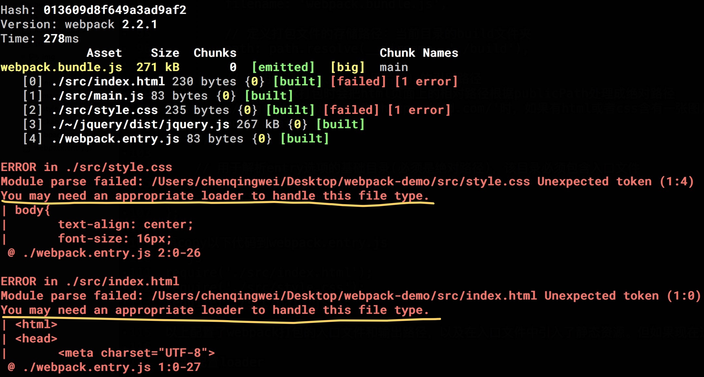
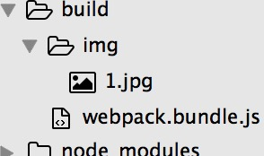

# 《一个最简单的webpack应用》
 
## 目标
建立一个lesson1项目，在项目中创建html、css、js、图片等静态文件，编写webpack配置文件，最后生成如下页面：   

  
要求：  
1、使用require引入jquery，且页面中要使用jquery来操作DOM，另外html文件要引用js、css、图片文件；  
2、输入命令`npm run build`能正确打包出静态文件，本地打开index.html时页面样式正常且无报错。

## 挑战
将原页面中的‘hello world’修改成‘你好 世界’、css文件打包命名为stylesheet.css，本地打开index.html时，能正确显示页面样式且无报错。

## 知识点
1、webpack配置文件。学习config部分常用参数含义及作用。  
2、webpack loader。使用loader来解析各种静态资源文件。  
3、webpack plugin。使用webpack插件来协助解析和生成资源。

## 课程内容
按照惯例，咱们先来个简单的 hello world 入门。  
okay，新建个lesson1文件夹，进入文件夹使用 npm 安装webpack到本地
```
mkdir lesson1 && cd lesson1
npm init -y
npm install webpack --save-dev
# 记得在package.json文件中编写npm指令（命令指代可以查看上一节`lesson0`）
```
新建src文件夹，在里面编写项目静态文件
```
mkdir src && cd src
# 新建html、css、js文件
touch index.html style.css main.js
# npm 安装jquery
npm install jquery --save
# 新建img文件夹，所有图片存储在里面
mkdir img 
```
copy以下内容到index.html
```html
<html>
 <head> 
  <meta charset="UTF-8" /> 
  <title>webpack-lesson1</title>
 </head> 
 <body> 
   
  <h1>hello world!!!</h1> 
 </body>
</html>
```
copy以下内容到style.css
```css
body {
  text-align: center;
  font-size: 16px;
}

img {
  width: 500px;
  height: auto;
}
```
copy以下内容到main.js
```js
var $ = require('jquery');
$("body").append('<h2>This is created by jquery!</h2>');
```
在img文件夹里面放入一张图片，比如说1.jpg  


### 编写配置文件
新建一个 webpack.config.js配置文件和 webpack.entry.js入口文件
```
touch webpack.config.js webpack.entry.js
```
copy以下代码到webpack.config.js
```js
//webpack配置文件符合commonJs模块规范
var path = require('path'); //这里引入path是为了解析相对路径，配置文件某些路径要求是绝对路径
module.exports = {
  // 入口文件，webpack据此对项目进行打包
  // 类型： String字符串 | Array数组 | Object对象
  // lesson1很简单，只使用一个入口
  entry: './webpack.entry.js',
  // webpack的入口文件，后面会创建
  // 定义webpack打包时的输出文件名及路径
  output: {
    // 定义webpack打包之后的文件名
    filename: 'webpack.bundle.js',

    // 定义打包文件的存储路径：当前目录的build文件夹
    path: path.resolve(__dirname, './build'),

    // 声明资源（js、css、图片等）的引用路径
    // webpack打包时会把html页面上的相对路径根据publicPath解析成绝对路径
    // eg：当publicPath为'https://jd.com/'时，如果有html或者css含有一张图片相对路径为'./img/test.jpg',打包之后html（或css）中图片的路径就会变成'https://jd.com/img/test.jpg'
    publicPath: ''
  },

  // 用于解析entry选项的基础目录(必须是绝对路径)，该目录必须包含入口文件
  // 默认: process.cwd()
  context: __dirname
};
```
再copy以下代码到webpack.entry.js
```js
// 入口文件在浏览器端的表现类似于html代码中的 < script >
// 在这里输入 console.log('Hello world!')，能在浏览器控制台看到打印结果
require('./src/index.html');
require('./src/style.css');
require('./src/main.js');
```
以上配置了webpack打包的入口文件和输出路径，以及在入口文件中引入了静态资源。但如果现在运行`npm run build`，命令行会报错，显示css和html文件解析错误：


### 配置loader

出现上图错误的原因是因为咱们还没有在webpack.config.js配置相应的loader来解析html和css的文件类型

#### 解析html文件
[html-loader](https://github.com/webpack-contrib/html-loader)可以用来解析html文件并以字符串string的形式传给webpack，此外可按需对html文件做压缩。
```
npm install html-loader --save-dev
```
#### 解析css文件
[css-loader](https://github.com/webpack-contrib/css-loader)能够解析css文件、并把解析后的css以字符串的形式传给[style-loader](https://github.com/webpack-contrib/style-loader)，style-loader在html中通过创建< style >标签引入css
```
npm install style-loader css-loader --save-dev
```
#### 解析png和jpg图片文件
[file-loader](https://github.com/webpack-contrib/file-loader)可以用来解析静态图片的引用，[url-loader](https://github.com/webpack-contrib/url-loader)是对file-loader的进一步封装，它可以把较小的图片转化成base64，它的使用也依赖于file-loader。
```
npm install file-loader url-loader --save-dev
```
安装完loaders之后，重新配置webpack.config.js  
copy以下代码到webpack.config.js
```js
//webpack配置文件符合commonJs模块规范
var path = require('path'); //这里引入path是为了解析相对路径，配置文件某些路径要求是绝对路径
module.exports = {
  // 入口文件，webpack据此对项目进行打包
  // 类型： String字符串 | Array数组 | Object对象
  // lesson1很简单，只使用一个入口
  entry: './webpack.entry.js',
  // webpack的入口文件，后面会创建
  // 定义webpack打包时的输出文件名及路径
  output: {
    // 定义webpack打包之后的文件名
    filename: 'webpack.bundle.js',

    // 定义打包文件的存储路径：当前目录的build文件夹
    path: path.resolve(__dirname, './build'),

    // 声明资源（js、css、图片等）的引用路径
    // webpack打包时会把html页面上的相对路径根据publicPath解析成绝对路径
    // eg：当publicPath为'https://jd.com/'时，如果有html或者css含有一张图片相对路径为'./img/test.jpg',打包之后html（或css）中图片的路径就会变成'https://jd.com/img/test.jpg'
    publicPath: ''
  },

  // 用于解析entry选项的基础目录(必须是绝对路径)，该目录必须包含入口文件
  // 默认: process.cwd()
  context: __dirname,

  // 定义项目里各种类型模块的处理方式
  module: {
    rules: [{
      test: /\.css$/,
      // 处理.css文件
      use: ['style-loader', 'css-loader']
    },
    {
      test: /\.(jpg|png)$/,
      // 处理.png和.jpg格式的图片文件
      use: ['url-loader?limit=10000&name=img/[name].[ext]'
      // limit参数指图片大小（10kb），当小于这个值时图片转为base64，当把值修改为60000时，1.jpg（50kb）会被解析成base64，打包后查看index.html代码可以看到
      // name参数指图片文件的命名格式，前面可以加 img/ 表示图片存储路径
      ]
    },
    {
      test: /\.html$/,
      // 处理.html文件
      use: ['html-loader']
    }]
  }
};
```
运行`npm run build`命令之后，显示成功打包，build文件夹目录结构如下：  
  
会发现html和css都被打包进了webpack.bundle.js文件里面，下面是webpack.bundle.js中html部分截图：  
  

### 配置plugins 
为了解决上面的问题，我们可以使用[html-webpack-plugin](https://github.com/jantimon/html-webpack-plugin)和[extract-text-webpack-plugin](https://github.com/webpack-contrib/extract-text-webpack-plugin)来将html、css代码片段从webpack.bundle.js中抽取出来并生成相应的html（或css）文件，extract-text-webpack-plugin会自动在生成的html文件中插入`<link>`标签引入css
```
npm install html-webpack-plugin extract-text-webpack-plugin --save-dev
```
copy以下代码到webpack.config.js
```js
//webpack配置文件符合commonJs模块规范
var path = require('path'),
//这里引入path是为了解析相对路径，配置文件某些路径要求是绝对路径
HtmlWebpackPlugin = require('html-webpack-plugin'),
//简化生成适合webpack打包的html
ExtractTextPlugin = require("extract-text-webpack-plugin"); //抽取css字符串并生成css文件
module.exports = {
  // 入口文件，webpack据此对项目进行打包
  // 类型： String字符串 | Array数组 | Object对象
  // lesson1很简单，只使用一个入口
  entry: './webpack.entry.js',
  // webpack的入口文件，后面会创建
  // 定义webpack打包时的输出文件名及路径
  output: {
    // 定义webpack打包之后的文件名
    filename: 'webpack.bundle.js',

    // 定义打包文件的存储路径：当前目录的build文件夹
    path: path.resolve(__dirname, './build'),

    // 声明资源（js、css、图片等）的引用路径
    // webpack打包时会把html页面上的相对路径根据publicPath解析成绝对路径
    // eg：当publicPath为'https://jd.com/'时，如果有html或者css含有一张图片相对路径为'./img/test.jpg',打包之后html（或css）中图片的路径就会变成'https://jd.com/img/test.jpg'
    publicPath: ''
  },

  // 用于解析entry选项的基础目录(必须是绝对路径)，该目录必须包含入口文件
  // 默认: process.cwd()
  context: __dirname,

  // 定义项目里各种类型模块的处理方式
  module: {
    rules: [{
      test: /\.css$/,
      // 处理.css文件
      use: ExtractTextPlugin.extract({
        fallback: "style-loader",
        use: "css-loader"
      })
    },
    {
      test: /\.(jpg|png)$/,
      // 处理.png和.jpg格式的图片文件
      use: ['url-loader?limit=10000&name=img/[name].[ext]'
      // limit参数指图片大小（10kb），当小于这个值时图片转为base64，当把值修改为60000时，1.jpg（50kb）会被解析成base64，打包后查看index.html代码可以看到
      // name参数指图片文件的命名格式，前面可以加 img/ 表示图片存储路径
      ]
    },
    {
      test: /\.html$/,
      // 处理.html文件
      use: ['html-loader']
    }]
  },

  // webpack插件
  plugins: [
    // 生成html文件
    new HtmlWebpackPlugin({
      template: './src/index.html',
      filename: 'index.html'
    }),

    // 生成css文件，一下括号中的'style.css' 是打包后的css文件名，可自定义
    new ExtractTextPlugin("style.css")
  ]
};
```
由于已经使用 html-webpack-plugin 以 index.html 为模版生成了html文件，webpack打包时会引入 index.html ，所以在webpack.entry.js中就没必要再次 `require('index.html')` ，修改完的webpack.entry.js如下：  
```js
// 入口文件在浏览器端的表现类似于html代码中的 < script >
// 在这里输入 console.log('Hello world!')，能在浏览器控制台看到打印结果
// require('./src/index.html');
require('./src/style.css');
require('./src/main.js');
```
运行`npm run build`命令，显示打包成功，build目录结构如下：  
  
成功生成独立的html和css文件，本地打开index.html，页面显示一切正常且无报错。  
棒棒哒～～～  

## 补充知识

1、entry属性：根据你的项目情况，如果是SPA（single page app 单页面应用），使用字符串即一个入口即可；如果是MPA（multiple page app），建议使用Object类型，每一个属性都是一个入口，入口名称是属性的名称，入口文件是属性的值  
2、extract-text-webpack-plugin可以自定义css文件名，也可以拆分成几个css文件，详情可看官方文档
