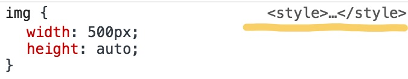
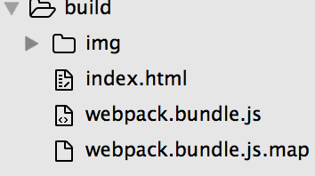
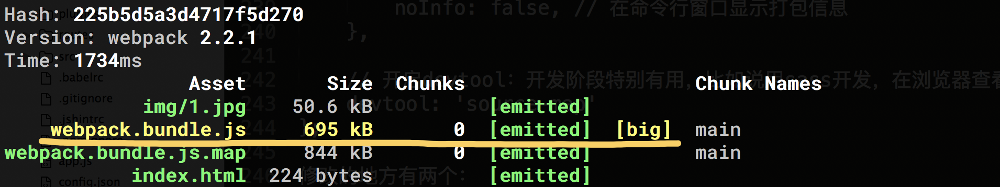
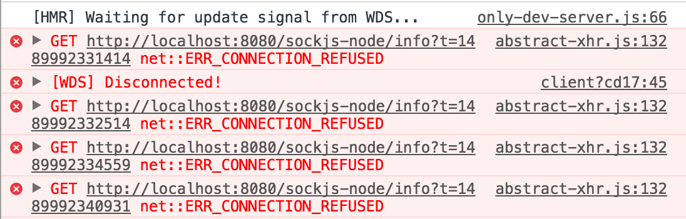
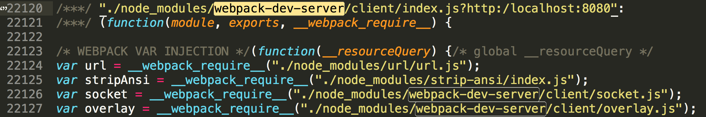

# 《使用webpack-dev-server实现热更新》

## 目标 
建立一个lesson2项目，内容与上一节的lesson1项目一致，当用浏览器访问`http://localhost:8080/index.html`时，修改任一html、css、js、图片文件，页面都会自动刷新。  

## 挑战
在原项目的基础上，将‘hello world’修改成‘你好 世界’、字体颜色修改成`#ccc`、并在2秒之后渐隐，浏览器页面`http://localhost:8080/index.html`会自动刷新，能正确显示页面样式且无报错。

## 知识点
1、webpack-dev-server及热更新。学习开发模式，并学会使用页面热更新功能。  

## 课程内容
webpack-dev-server很棒的一点就是当修改页面文件时，页面不会整页刷新，而是会热更新，当页面模块很多体积较大时，可以帮我们省下一大把时间。我很看好这一种做法，相信以后这种做法也会成为开发模式的标准。接下来咱们一起在lesson1项目的基础上加入webpack-dev-server。  
首先安装npm包
```
npm install webpack-dev-server --save-dev
```
### 编写配置文件

copy以下代码到webpack.config.js
```js
var path = require('path'),
    HtmlWebpackPlugin = require('html-webpack-plugin'),
    ExtractTextPlugin = require("extract-text-webpack-plugin"),
    webpack = require('webpack');  //这里引入webpack是为了使用webpack的热更新功能以及其他自带插件，见 module.exports.plugins

module.exports = {
    entry: [
        // 给webpack-dev-server启动一个本地服务，并连接到8080端口
        'webpack-dev-server/client?http://localhost:8080',

        // 给上面启动的本地服务开启自动刷新功能，'only-dev-server'的'only-'意思是只有当模块允许被热更新之后才有热加载，否则就是整页刷新
        'webpack/hot/only-dev-server',

        // webpack的入口文件，注意这个声明必须写在上面两个后面，webpack-dev-server才有效
        './webpack.entry.js'
    ],
    output: {
        filename: 'webpack.bundle.js',
        path: path.resolve(__dirname, './build'),
        publicPath: ''
    },
    context: __dirname,
    module: {
        rules: [{
            test: /\.css$/, 
            use: ExtractTextPlugin.extract({
                fallback: "style-loader",
                use: "css-loader"
            })
        }, {
            test: /\.(jpg|png)$/,
            use: [
                'url-loader?limit=10000&name=img/[name].[ext]'
            ]
        }, {
            test: /\.html$/,
            use: [
                'html-loader'
            ]
        }]
    },
    plugins: [
        new HtmlWebpackPlugin({
            template: './src/index.html',
            filename: 'index.html'
        }),
        new ExtractTextPlugin("style.css"),
        // 开启webpack全局热更新
        new webpack.HotModuleReplacementPlugin(),

        // 当接收到热更新信号时，在浏览器console控制台打印更多可读性高的模块名称等信息
        new webpack.NamedModulesPlugin(),
    ],

    // 定义webpack-dev-server
    devServer: {
        contentBase: path.resolve(__dirname, 'src'), // 静态文件目录位置，只有当你需要在webpack-dev-server本地服务器查看或引用静态文件时用到。类型：boolean | string | array, 建议使用绝对路径
        hot: true, // 模块热更新。依赖于HotModuleReplacementPlugin
        noInfo: false, // 在命令行窗口显示打包信息
    }
};
```
主要修改的地方在于：  
1、 `require('webpack')`   
2、在entry属性中插入了两个webpack-dev-server入口  
3、给plugins属性增添了webpack自带的HotModuleReplacementPlugin、NamedModulesPlugin两个插件，前者对于热更新是必须的  
4、声明了devServer属性  
  
运行`npm  start`命令，浏览器访问`http://localhost:8080/index.html`，页面显示正常。修改并保存style.css，发现浏览器并没有自动刷新页面，问题来了！  
打开浏览器控制台，能看到每次修改保存style.css的时候，webpack-dev-server都能监控到代码变化。  
  

### 问题元凶：extract-text-webpack-plugin

extract-text-webpack-plugin不支持热更新，当使用extract-text-webpack-plugin时样式就没法热加载，这个问题在它的github主页上有提到  
  
那为什么浏览器能监听到style.css的变动呢，那是因为咱们在入口文件webpack.entry.js中写入了`require('./src/style.css')`，webpack会对require的文件保持监听。为了解决问题，咱们尝试一下不用extract-text-webpack-plugin，只用style-loader和css-loader  
copy以下代码到webpack.config.js
```js
var path = require('path'),
    HtmlWebpackPlugin = require('html-webpack-plugin'),
    webpack = require('webpack');  //这里引入webpack是为了使用webpack的热更新功能以及其他自带插件，见 module.exports.plugins

module.exports = {
    entry: [
        // 给webpack-dev-server启动一个本地服务，并连接到8080端口
        'webpack-dev-server/client?http://localhost:8080',

        // 给上面启动的本地服务开启自动刷新功能，'only-dev-server'的'only-'意思是只有当模块允许被热更新之后才有热加载，否则就是整页刷新
        'webpack/hot/only-dev-server',

        // webpack的入口文件，注意这个声明必须写在上面两个后面，webpack-dev-server才有效
        './webpack.entry.js'
    ],
    output: {
        filename: 'webpack.bundle.js',
        path: path.resolve(__dirname, './build'),
        publicPath: ''
    },
    context: __dirname,
    module: {
        rules: [{
            test: /\.css$/, 
            use: [
                'style-loader',
                'css-loader?sourceMap'
            ]
        }, {
            test: /\.(jpg|png)$/,
            use: [
                'url-loader?limit=10000&name=img/[name].[ext]'
            ]
        }, {
            test: /\.html$/,
            use: [
                'html-loader'
            ]
        }]
    },
    plugins: [
        new HtmlWebpackPlugin({
            template: './src/index.html',
            filename: 'index.html'
        }),
        // 开启webpack全局热更新
        new webpack.HotModuleReplacementPlugin(),

        // 当接收到热更新信号时，在浏览器console控制台打印更多可读性高的模块名称等信息
        new webpack.NamedModulesPlugin(),
    ],

    // 定义webpack-dev-server
    devServer: {
        contentBase: path.resolve(__dirname, 'src'), // 静态文件目录位置，只有当你需要在webpack-dev-server本地服务器查看或引用静态文件时用到。类型：boolean | string | array, 建议使用绝对路径
        hot: true, // 模块热更新。依赖于HotModuleReplacementPlugin
        noInfo: false, // 在命令行窗口显示打包信息
    }
};
```
运行`npm start`命令，再次修改保存style.css，可以看到浏览器页面能够自动刷新了，且每次刷新时都不用刷新整个页面（不信的话可以打开浏览器控制台查看热更新信息，会发现每次页面刷新的时候控制台的信息不会被清零），棒！  
诶～问题又来了！！！修改index.html文件时，页面没有自动自动刷新。

### 问题缘由：index.html没有处于被webpack监听的状态

webpack只会监听被require或import的文件，copy以下代码到webpack.entry.js
```js
require('./src/index.html');
require('./src/style.css');
require('./src/main.js');
```
重新运行`npm start`命令，修改保存index.html，页面自动刷新，完美～～～  
至此，咱们已经可以随意修改html、css、js、图片等文件并实现页面自动热更新了。 
  

### devtool

在做样式调整时，比如说要修改项目中图片的大小，在浏览器选中图片，能看到样式都在`<head>`中的`<style>`标签中    
  
当页面某个部分样式要调整时，由于不知道对应样式的具体位置，会增加修改的时间成本。webpack有个属性能把样式都索引到对应的css文件里面，这个属性就是 devtool，特别当页面很复杂，多个模块引入多个css文件时，devtool能大大提高咱们的调试效率，不止是锦上添花，更是雪中送炭啊～  
copy以下代码到webpack.config.js
```js
var path = require('path'),
    HtmlWebpackPlugin = require('html-webpack-plugin'),
    webpack = require('webpack');  //这里引入webpack是为了使用webpack的热更新功能以及其他自带插件，见 module.exports.plugins

module.exports = {
    entry: [
        // 给webpack-dev-server启动一个本地服务，并连接到8080端口
        'webpack-dev-server/client?http://localhost:8080',

        // 给上面启动的本地服务开启自动刷新功能，'only-dev-server'的'only-'意思是只有当模块允许被热更新之后才有热加载，否则就是整页刷新
        'webpack/hot/only-dev-server',

        // webpack的入口文件，注意这个声明必须写在上面两个后面，webpack-dev-server才有效
        './webpack.entry.js'
    ],
    output: {
        filename: 'webpack.bundle.js',
        path: path.resolve(__dirname, './build'),
        publicPath: ''
    },
    context: __dirname,
    module: {
        rules: [{
            test: /\.css$/, 
            use: [
                'style-loader',
                'css-loader?sourceMap' // 这里需要配置sourceMap参数
            ]
        }, {
            test: /\.(jpg|png)$/,
            use: [
                'url-loader?limit=10000&name=img/[name].[ext]'
            ]
        }, {
            test: /\.html$/,
            use: [
                'html-loader'
            ]
        }]
    },
    plugins: [
        new HtmlWebpackPlugin({
            template: './src/index.html',
            filename: 'index.html'
        }),
        // 开启webpack全局热更新
        new webpack.HotModuleReplacementPlugin(),

        // 当接收到热更新信号时，在浏览器console控制台打印更多可读性高的模块名称等信息
        new webpack.NamedModulesPlugin(),
    ],

    // 定义webpack-dev-server
    devServer: {
        contentBase: path.resolve(__dirname, 'src'), // 静态文件目录位置，只有当你需要在webpack-dev-server本地服务器查看或引用静态文件时用到。类型：boolean | string | array, 建议使用绝对路径
        hot: true, // 模块热更新。依赖于HotModuleReplacementPlugin
        noInfo: false, // 在命令行窗口显示打包信息
    },

    // 开启devtool：开发阶段特别有用，比如说用sass开发，在浏览器查看样式时可以方便知道该样式是映射到sass具体的第几行
    devtool: 'source-map'
};
```
修改的地方有两个：  
1、配置了devtool属性  
2、在module属性 --> rules --> css-loader 添加了sourceMap参数  
重新运行`npm start`命令，能看到样式映射的目标已经达到了  
  

#### 补充

devtool属性值还有其他选项可供选择，差别表现在打包耗时、sourceMap精确度等，详见：https://webpack.js.org/configuration/devtool/ ，根据实际项目情况来判断使用哪个选项值。

## 总结

以上虽然解决了开发时热更新的问题，但在开发阶段结束要对文件进行打包时，理论上会出现两个不足之处：  
1、在lesson1有提到，不使用extract-text-webpack-plugin时style.css会被打包进webpack.bundle.js里面；  
2、在入口文件`require('index.html')`会导致webpack打包时把index.html打包到 webpack.bundle.js 中，而咱们已经使用 html-webpack-plugin 以 index.html 为模版生成了html文件，这样会造成资源重复。  
咱们来试试，运行`npm run build`命令，打包完成之后目录结构如下：  
  
会发现没有style.css生成，搜索webpack.bundle.js，能看到style.css和index.html的代码  
  
  
3、打包后的webpack.bundle.js文件非常大，近700kb，就算是1、2点中提到的把index.html和style.css一起打包进去，也不可能这么大  
  
本地打开index.html，看到控制台有报错信息  
  
报错信息看起来很熟悉，跟开发时热更新的提示信息是类似的， 在webpack.bundle.js中检索`webpack-dev-server`，能看到对应打包后的代码  
  
这几个问题咱们一起在下一节lesson3解决。