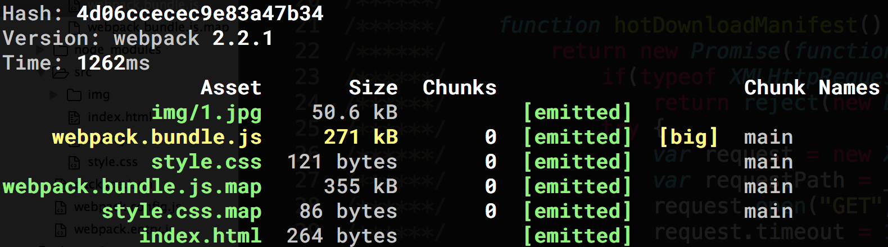
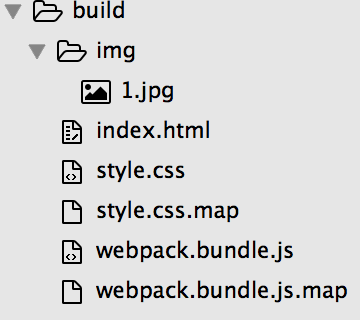

# 《兼容开发和生产环境的配置文件》

## 目标
建立一个lesson3项目，解决上一节lesson2遗留下来的--即开发环境打包到生产环境的问题。

## 知识点
1、process.env.NODE_ENV：node运行环境变量。  

## 课程内容
process.env.NODE_ENV是node运行时的全局变量，node服务端中的任一js文件中都可以拿到它的值，先来试试是否真的能获取到值  
先新建一个lesson3的项目，再创建一个test.js文件
```
mkdir lesson3 && cd lesson3
touch test.js
```
copy以下代码到test.js
```js
console.log(process.env.NODE_ENV);
```
在命令行输入
```
# 以下是非window系统的命令，如果你当前的系统是window，请使用命令`SET NODE_ENV=development&& node test.js`，否则命令行会返回`undefined`结果
export NODE_ENV=development&& node test.js
```
输出结果是`development`，棒！  
上一节lesson2遗留下来的问题是使用了开发模式后（webpack-dev-server），webpack打包时会把html和css文件、webpack-dev-server开发文件、webpack.HotModuleReplacementPlugin()插件统统打包到了webpack.bundle.js文件中，而在lesson1的生产模式中我们的确成功打包出理想状态的文件。思考一下，咱们是不是可以这么操作，通过获取NODE_ENV的值，判断当前命令的环境是开发还是生产环境，如果是生产环境，咱们就使用extract-text-webpack-plugin抽取css代码块、删除webpack.entry.js中的`require('index.html')`和webpack-dev-server入口、以及删除对HotModuleReplacementPlugin插件的引入，否则，相反。  
okay，npm初始化下、安装各个npm包
```
npm init -y
npm install webpack webpack-dev-server css-loader extract-text-webpack-plugin file-loader html-loader html-webpack-plugin style-loader url-loader --save-dev
npm install jquery --save
```
配置package.json命令行
```
"scripts": {
  "start": "export NODE_ENV=development && node_modules/.bin/webpack-dev-server",
  "build": "export NODE_ENV=production  && node_modules/.bin/webpack"
}
```
copy以下代码到webpack.config.js
```js
var path = require('path'),
HtmlWebpackPlugin = require('html-webpack-plugin'),
webpack = require('webpack'),
ExtractTextPlugin = require("extract-text-webpack-plugin");

module.exports = {
  entry: process.env.NODE_ENV === 'production' ? './webpack.entry.js': ['webpack-dev-server/client?http://localhost:8080', 'webpack/hot/only-dev-server', './webpack.entry.js'],
  output: {
    filename: 'webpack.bundle.js',
    path: path.resolve(__dirname, './build'),
    publicPath: ''
  },
  context: __dirname,
  module: {
    rules: [{
      test: /\.css$/,
      use: process.env.NODE_ENV === 'production' ? ExtractTextPlugin.extract({
        fallback: "style-loader",
        use: "css-loader"
      }) : ['style-loader', 'css-loader?sourceMap']
    },
    {
      test: /\.(jpg|png)$/,
      use: ['url-loader?limit=10000&name=img/[name].[ext]']
    },
    {
      test: /\.html$/,
      use: ['html-loader']
    }]
  },
  plugins: process.env.NODE_ENV === 'production' ? [
    new HtmlWebpackPlugin({
      template: './src/index.html',
      filename: 'index.html'
    }), 
    new ExtractTextPlugin("style.css"), 
    new webpack.DefinePlugin({
      'NODE_ENV': JSON.stringify(process.env.NODE_ENV) // 直接传字符串的话webpack会把它当作代码片段来编译，这里用JSON.stringify()做字符串化处理
    })
  ] : [
    new HtmlWebpackPlugin({
      template: './src/index.html',
      filename: 'index.html'
    }), 
    new webpack.HotModuleReplacementPlugin(), 
    new webpack.NamedModulesPlugin(), 
    new webpack.DefinePlugin({
      'NODE_ENV': JSON.stringify(process.env.NODE_ENV)
    })
  ],
  devServer: {
    contentBase: path.resolve(__dirname, 'src'),
    hot: true,
    noInfo: false
  },
  devtool: 'source-map'
};
```
相比于上一届lesson2的webpack.config.js，修改的地方有3个：  
1、引入了extract-text-webpack-plugin：`require("extract-text-webpack-plugin")`；  
2、在entry、module --> rules --> css、 plugins中，添加了对NODE_ENV的判断；  
3、在plugins属性中增添了`new ExtractTextPlugin("style.css")`以及`webapck.DefinePlugin()`，用webapck.DefinePlugin可以把process.env.NODE_ENV暴露给webpack整个编译的过程，也就是让webpack.entry.js也能获取到process.env.NODE_ENV的值（webpack.entry.js运行在浏览器端，并不能直接获取到process.env.NODE_ENV）  
  
copy以下代码到webpack.entry.js
```js
if (NODE_ENV === 'development') {
  require('./src/index.html');
}
require('./src/style.css');
require('./src/main.js');
```
最后将上一节lesson2中的`src`开发目录复制到lesson3中，命令行运行`npm start`，修改html、css等文件时，浏览器自动刷新，一切符合预期，棒！  
退出执行`npm run build`，打包生成的webpack.bundle.js由原本的700kb到现在的270kb（除去jquery源文件大小的话就只有3kb，下一节晋级篇会讲授怎么把第三方库独立引入），改善非常可观！  
  
打包完目录结构如下：（.map是sourceMap文件）  
  
正常生成index.html和style.css，在webpack.bundle.js中也没有重复打包html和css，本地打开index.html时，页面显示正常，棒！  

## 总结

其实上面这种解决方案是比较复杂的，还有另外一种方式就是把生产环境和开发环境的配置文件分开写并保存到两个文件中，但对于我这种有代码洁癖的人来说，我接受不了。🌝🌖🌗🌘🌚

