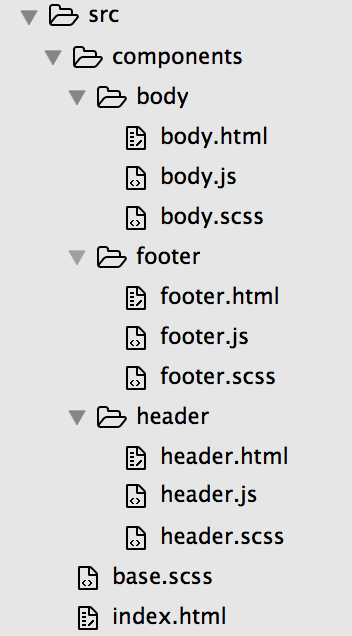
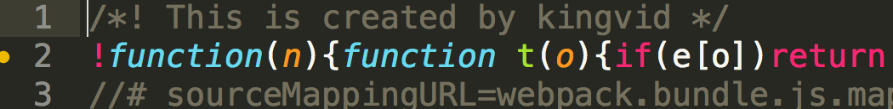
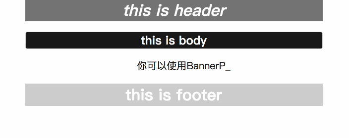

# 《晋级篇：SPA单页面应用（组件化开发+SASS+ES6）》

## 目标
建立一个lesson4项目，基于sass编写css、基于ES6语法规则编写js代码实现组件化开发。

## 挑战
在原项目基础上把html语言改成vue或react，进行组件化开发。

## 知识点
1、sass：用sass代替编写css；  
2、ES6语法：ES6新增了很多有趣的特性；  
3、externals：打包时忽略第三方库，比如说jquery；  
4、resolve属性：改变模块的处理方式；  
5、UglifyJsPlugin：webpack自带插件，可以对打包js文件进行压缩或美化处理；  
6、BannerPlugin：给打包文件头部加上你的签名；    
7、open-browser-webpack-plugin：自动打开浏览器插件；  

## 课程内容
新建一个lesson4文件，做初始化
```
mkdir lesson4 && cd lesson4
npm init -y
npm install webpack webpack-dev-server css-loader extract-text-webpack-plugin file-loader html-loader html-webpack-plugin style-loader url-loader --save-dev
touch webpack.config.js webpack.entry.js
mkdir src && cd src
touch index.html 
mkdir components && cd components
mkdir header body footer
touch header/header.html header/header.scss header/header.js body/body.html body/body.scss body/body.js footer/footer.html footer/footer.scss footer/footer.js
```
初始化完之后对应开发文件目录结构如下：  
  
copy以下代码到index.html
```html
<html>
 <head> 
  <meta charset="UTF-8" /> 
  <title>webpack-lesson4</title> 
 </head> 
 <body> 
  <header> 
   <!-- html-loader：用于引入对应资源  --> 
   ${require('./components/header/header.html')} 
  </header> 
  <section>
    ${require('./components/body/body.html')} 
  </section> 
  <footer>
    ${require('./components/footer/footer.html')} 
  </footer> 
  <!-- 跟webpack.config.js中的externals属性结合，作用包括：1、打包时会忽略jquery文件；2、可全局调用jquery --> 
  <script type="text/javascript" src="//cdn.bootcss.com/jquery/3.2.0/jquery.min.js"></script>  
 </body>
</html>
```
copy以下代码到header.html
```html
<h1 class="header-title">this is header</h1>
```
copy以下代码到body.html
```html
<h1 class="body-title">this is body</h1>
<ul class="body-list">
  <li class="body-list-item" id="body-input">你可以使用BannerPlugin给你的每个打包文件加上你的签名<br>webpack教程<br>by kingvid</li>
</ul>
```
copy以下代码到footer.html
```html
<h1 class="footer-title">this is footer</h1>
```
copy以下代码到header.scss
```css
.header-title{
  font-style: italic;
  background-color: rgba(100,100,100,0.9);
  color: #fff;
}
```
copy以下代码到body.scss
```css
.body-title{
  border-radius: 4px;
  border: solid 1px #ccc; 
  color: #fff;
  background-color: rgba(0,0,0,0.9);
}
.body-list{
  margin: auto;
  list-style: none;

  .body-list-item{
    font-size: 20px;
  }
}
```
copy以下代码到footer.scss
```css
.footer-title{
  color: #fff;
  background-color: rgba(200,200,200,0.9);
}
```
copy以下代码到body.js
```js
// 这里不再需要再import或require jquery，在webpack.config.js中新增了externals属性，让jquery可以在webpack整个运行环境中被调用
let element = $("#body-input"),
str = element.html(),
progress = 0,
timer = setInterval(() = >{
  let current = str.substr(progress, 1);
  if (current == '<') {
    progress = str.indexOf('>', progress) + 1;
  } else {
    progress++;
  }
  element.html(str.substring(0, progress) + (progress && 1 ? '_': ''));
  if (progress >= str.length) {
    clearInterval(timer);
    element.html(str.substring(0, progress));
  }
},
150);
```
配置package.json命令行
```
"scripts": {
  "start": "export NODE_ENV=development && node_modules/.bin/webpack-dev-server",
  "build": "export NODE_ENV=production  && node_modules/.bin/webpack"
}
```
[sass-loader](https://github.com/webpack-contrib/sass-loader)用来解析scss文件，它的安装依赖于`node-sass`
```
npm install sass-loader node-sass --save-dev
```
[babel-loader](https://github.com/babel/babel-loader)可以将ES6语法转化成能被浏览器识别的ES5，开发js我们就能使用最新的ES6语法了
```
npm install --save-dev babel-loader babel-core babel-preset-env
```
copy以下代码到webpack.config.js
```js
var path = require('path'),
HtmlWebpackPlugin = require('html-webpack-plugin'),
webpack = require('webpack'),
ExtractTextPlugin = require("extract-text-webpack-plugin"),
OpenBrowserPlugin = require('open-browser-webpack-plugin');

module.exports = {
  entry: process.env.NODE_ENV === 'production' ? './webpack.entry': ['webpack-dev-server/client?http://localhost:8080', 'webpack/hot/only-dev-server', './webpack.entry.js'],
  output: {
    filename: 'webpack.bundle.js',
    path: path.resolve(__dirname, './build'),
    publicPath: ''
  },
  context: __dirname,
  module: {
    rules: [{
      test: /\.scss$/,
      // 解析scss文件
      use: process.env.NODE_ENV === 'production' ? ExtractTextPlugin.extract({
        fallback: "style-loader",
        use: ["css-loader", "sass-loader"]
      }) : ['style-loader', 'css-loader?sourceMap', 'sass-loader?sourceMap']
    },
    {
      test: /\.(jpg|png)$/,
      use: ['url-loader?limit=10000&name=img/[name].[ext]']
    },
    {
      test: /\.html$/,
      use: {
        loader: 'html-loader',
        options: {
          interpolate: 'require'
        }
      }
    },
    {
      test: /\.js$/,
      exclude: /node_modules/,
      use: {
        loader: 'babel-loader',
        options: {
          presets: ['env']
        }
      }
    }]
  },
  plugins: process.env.NODE_ENV === 'production' ? [new HtmlWebpackPlugin({
    template: './src/index.html',
    filename: 'index.html'
  }), new ExtractTextPlugin("style.css"), new webpack.DefinePlugin({
    'NODE_ENV': JSON.stringify(process.env.NODE_ENV)
  }),
  // 压缩js文件
  new webpack.optimize.UglifyJsPlugin({
    compress: {
      warnings: true
    }
  }),

  // 给打包文件加上你的签名
  new webpack.BannerPlugin({
    banner: 'This is created by kingvid'
  })] : [new HtmlWebpackPlugin({
    template: './src/index.html',
    filename: 'index.html'
  }), new webpack.HotModuleReplacementPlugin(), new webpack.NamedModulesPlugin(), new webpack.DefinePlugin({
    'NODE_ENV': JSON.stringify(process.env.NODE_ENV)
  }), new OpenBrowserPlugin({
    url: 'http://localhost:8080/'
  }) // 自动在浏览器中打开 http://localhost:8080/
  ],
  devServer: {
    contentBase: path.resolve(__dirname, 'src'),
    hot: true,
    noInfo: false
  },
  devtool: 'source-map',

  // 打包时将不会把以下第三方库打包进webpack.bundle.js中但可被webpack全局调用，比如说jquery，但需要在html文件中用script引入jquery
  externals: {
    jquery: 'jQuery'
  },

  // 改变模块的处理方式
  resolve: {
    extensions: ['.js', '.scss', '.html'],
    // eg：入口文件改成webpack.entry，打包时webpack会先检索webpack.entry文件，返回结果为空时给文件补上.js文件尾缀再继续检索，依此类推。
    alias: {
      // 这里可以给一些常用的模块添加别名，可以减少webpack查找该模块的时间，比如说：vue
      // 'vue': 'vue/dist/vue.common.js'
    }
  }
};
```
修改的地方主要有：  
1、修改loader：sass和babel；  
2、在plugins新增UglifyJsPlugin插件，打包时会对js文件做压缩；  
3、OpenBrowserPlugin：运行`npm start`命令会自动打开浏览器窗口；  
4、新增resolve属性：给文件自动添加尾缀、减少webpack查找常用模块的时间；   
5、新增externals属性：引入且不打包第三方库；   
6、在plugins新增BannerPlugin插件，运行`npm run build`，打开webpack.bundle.js可看到  
  

copy以下代码到webpack.entry.js
```js
const cssAndJsContext = require.context('./src', true, /\.(js|scss)$/i);

console.log(cssAndJsContext.keys());
// 结果是：["./base.scss","./components/body/body.js","./components/body/body.scss","./components/footer/footer.js","./components/footer/footer.scss","./components/header/header.js","./components/header/header.scss"]
// cssAndJsContext('./base.scss') 相当于 require("./src/base.scss");
cssAndJsContext.keys().forEach((key) = >{
  cssAndJsContext(key);
});

if (NODE_ENV === 'development') {
  const htmlContext = require.context('./src', true, /\.html$/i);
  htmlContext.keys().forEach((key) = >{
    htmlContext(key);
  });
}
```
`require.context`的作用是可以把在自己设置的目录下所有符合条件的文件一次性require到webpack运行环境中，它有三个参数：  
```
require.context(directory, useSubdirectories = false, regExp = /^\.\//)
# 它会返回一个webpackContext的函数结果，通过调用返回对象的.keys()方法可以获取检索结果
# directory：设定在哪个目录下检索文件，必须是相对路径
# useSubdirectories：是否在当前目录下的所有子目录进行检索，而不限制只在directory当前目录下检索
# regExp：正则表达式，即检索条件，webpack.entry.js检索条件是所有文件名以.js或.scss结尾的文件，且不区分大小写
```
运行`npm run build`，本地打开index.html，效果如下：  
  

### 补充

上面提到的require.context()会把在主目录下所有符合条件的文件路径都返回出来，如果要直接在require中使用变量表达式动态引入模块的话，要注意引入格式，先看个例子：  
```js
var name = './src/base.scss';
require(name);
```
在webpack.entry.js中写入以上代码的话，解析会报错且require不到base.scss，如果这样写
```js
var name = 'base';
require('./src/'+name+'.scss');
```
就能成功require到base.scss文件，这是因为webpack在解析require函数调用时会抽取两个信息：  
```
Directory（指定目录）: ./src
Regular expression（检索条件）: /^.*\.scss$/
```
只有成功拿到这两个信息之后，webpack才会在指定目录下寻找符合条件的文件。

## 总结

对于第三方库的引入，上面的externals需要在html中手动引入jquery，可能有些人会觉得麻烦，其实还有另外一种解决方案，这里就要用到webpack强大的也更为复杂的`code splitting`，即代码分割。见下一节lesson5

