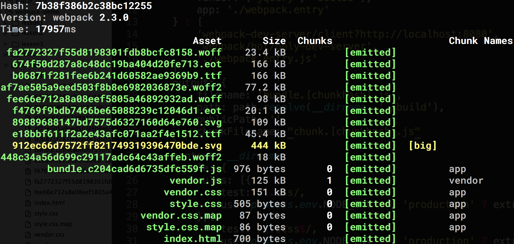
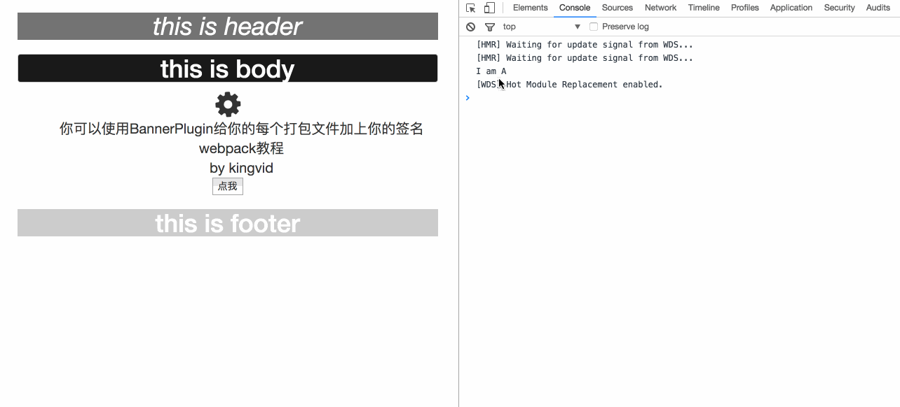

# 《晋级篇（续）：复杂项目下的代码分割》

## 目标
咱们在lesson4的基础上接着讲，这一节要解决两个问题：  
1、第三方库的引入；  
2、复杂项目下的按需加载。

## 知识点
1、使用extract-text-webpack-plugin打包多个css文件；  
2、CommonsChunkPlugin：抽取公共模块；  
3、ProvidePlugin：全局调用某模块；  
4、require.ensure()：按需加载模块。  

## 课程内容  
咱们还是以lesson4的demo为准，把lesson4的src开发目录复制到lesson5下，这一次咱们把项目搞得相对复杂一些，虽说现在比较成熟的前端团队都会有自己的ui库，为了方便咱们还是从成熟的bootstrap和font-awesome来切入，需要注意的是要处理好jquery和bootstrap的依赖关系。  
首先把index.html中的
```
<script type="text/javascript" src="http://cdn.bootcss.com/jquery/3.2.0/jquery.min.js"></script>
```
删除，然后npm安装jquery、bootstrap和font-awesome
```
npm install jquery bootstrap font-awesome --save
```
copy以下代码到webpack.config.js中
```js
const path = require('path'),
HtmlWebpackPlugin = require('html-webpack-plugin'),
webpack = require('webpack'),
ExtractTextPlugin = require("extract-text-webpack-plugin"),
OpenBrowserPlugin = require('open-browser-webpack-plugin'),
extractVendor = new ExtractTextPlugin('vendor.css'),
// 抽取bootstrap和font-awesome公共样式
extractStyle = new ExtractTextPlugin('style.css'); // 抽取自定义样式
module.exports = {
  entry: process.env.NODE_ENV === 'production' ? {
    vendor: ['jquery', 'bootJs'],
    app: './webpack.entry'
  }: ['webpack-dev-server/client?http://localhost:8080', 'webpack/hot/only-dev-server', './webpack.entry.js'],
  output: {
    filename: 'bundle.[hash].js',
    path: path.resolve(__dirname, './build'),
    publicPath: ''
  },
  context: __dirname,
  module: {
    rules: [{
      test: /\.css/,
      use: process.env.NODE_ENV === 'production' ? extractVendor.extract({
        fallback: "style-loader",
        use: "css-loader?minimize=true"
      }) : ['style-loader', 'css-loader?sourceMap']
    },
    {
      test: /\.scss$/,
      use: process.env.NODE_ENV === 'production' ? extractStyle.extract({
        fallback: "style-loader",
        use: ["css-loader", "sass-loader"]
      }) : ['style-loader', 'css-loader?sourceMap', 'sass-loader?sourceMap']
    },
    {
      test: /\.(jpg|png)$/,
      use: ['url-loader?limit=10000&name=img/[name].[ext]']
    },
    {
      test: /\.html$/,
      use: 'html-loader?interpolate=require'
    },
    {
      test: /\.js$/,
      exclude: /node_modules/,
      use: {
        loader: 'babel-loader',
        options: {
          presets: ['env']
        }
      }
    },
    {
      test: /\.(eot|svg|ttf|woff|woff2)(\?\S*)?$/,
      use: ['file-loader?name=fonts/[name].[ext]']
    }]
  },
  plugins: process.env.NODE_ENV === 'production' ? [new HtmlWebpackPlugin({
    template: './src/index.html',
    filename: 'index.html'
  }), extractVendor, extractStyle, new webpack.DefinePlugin({
    'NODE_ENV': JSON.stringify(process.env.NODE_ENV)
  }), new webpack.optimize.UglifyJsPlugin({
    compress: {
      warnings: true
    }
  }),
  // CommonsChunkPlugin可以让我们在几个模块之间抽取出公共部分内容，并且把他们添加到公共的打包模块中
  new webpack.optimize.CommonsChunkPlugin({
    name: "vendor",
    // 模块名
    filename: "vendor.js",
    // 文件名
    minChunks: Infinity,
    // 该模块至少被其他模块调用多少次时，才会被打包到公共模块中，这个数字必须大于等于2，当传入Infinity时会马上生成
  }),

  // ProvidePlugin可以全局引入某个模块，在其他模块不需要再手动引入且可以直接调用，也能解决其他第三方库(像bootstrap)对jquery的依赖
  new webpack.ProvidePlugin({
    $: 'jquery',
    // $ 是jquery的模块输出对象，下面的jQuery也是一样的，在其他模块中可以直接被调用
    jQuery: 'jquery'
  })] : [new HtmlWebpackPlugin({
    template: './src/index.html',
    filename: 'index.html'
  }), new webpack.HotModuleReplacementPlugin(), new webpack.NamedModulesPlugin(), new webpack.DefinePlugin({
    'NODE_ENV': JSON.stringify(process.env.NODE_ENV)
  }), new OpenBrowserPlugin({
    url: 'http://localhost:8080/'
  }), new webpack.ProvidePlugin({
    $: 'jquery',
    jQuery: 'jquery'
  })],
  devServer: {
    contentBase: path.resolve(__dirname, 'src'),
    hot: true,
    noInfo: false
  },
  devtool: 'source-map',
  resolve: {
    extensions: ['.js', '.scss', '.html'],
    alias: {
      'jquery': 'jquery/dist/jquery.min.js',
      'bootCss': 'bootstrap/dist/css/bootstrap.css',
      'bootJs': 'bootstrap/dist/js/bootstrap.js',
      'fontAwesome': 'font-awesome/css/font-awesome.css'
    }
  }
};
```
copy以下代码到webpack.entry.js
```js
import "bootCss";
import "fontAwesome";
import "bootJs";

const cssAndJsContext = require.context('./src', true, /\.(js|scss)$/i);
cssAndJsContext.keys().forEach((key) = >{
  cssAndJsContext(key);
});

if (NODE_ENV === 'development') {
  const htmlContext = require.context('./src', true, /\.html$/i);
  htmlContext.keys().forEach((key) = >{
    htmlContext(key);
  });
}
```
运行`npm build`命令，打包后文件如下：  
  
jquery和bootstrap.js被打包在vendor.js，bootstrap.css和font-awesome.css被打包在vendor.css中，本地打开index.html文件，页面显示正常。于此，咱们解决了第一个问题“第三方库的引入”。  
随着项目体积越来越大，有些文件我们不需要页面初始化的时候就加载进来，而应该是当用户发生某个操作之后，按需加载。这里我们就需要用到`require.ensure()`  
在webpack.config.js文件中的output属性增加一项参数：`chunkFilename`，copy以下代码到webpack.config.js
```js
const path = require('path'),
HtmlWebpackPlugin = require('html-webpack-plugin'),
webpack = require('webpack'),
ExtractTextPlugin = require("extract-text-webpack-plugin"),
OpenBrowserPlugin = require('open-browser-webpack-plugin'),
extractVendor = new ExtractTextPlugin('vendor.css'),
// 抽取bootstrap和font-awesome公共样式
extractStyle = new ExtractTextPlugin('style.css'); // 抽取自定义样式
module.exports = {
  entry: process.env.NODE_ENV === 'production' ? {
    vendor: ['jquery', 'bootJs'],
    app: './webpack.entry'
  }: ['webpack-dev-server/client?http://localhost:8080', 'webpack/hot/only-dev-server', './webpack.entry.js'],
  output: {
    filename: 'bundle.[hash].js',
    path: path.resolve(__dirname, './build'),
    publicPath: '',
    chunkFilename: "chunk.[name].[chunkhash].js" // 对于按需加载的模块，都不会写在entry入口文件中，chunkFilename是给这些按需加载模块的命名规则
  },
  context: __dirname,
  module: {
    rules: [{
      test: /\.css/,
      use: process.env.NODE_ENV === 'production' ? extractVendor.extract({
        fallback: "style-loader",
        use: "css-loader?minimize=true"
      }) : ['style-loader', 'css-loader?sourceMap']
    },
    {
      test: /\.scss$/,
      use: process.env.NODE_ENV === 'production' ? extractStyle.extract({
        fallback: "style-loader",
        use: ["css-loader", "sass-loader"]
      }) : ['style-loader', 'css-loader?sourceMap', 'sass-loader?sourceMap']
    },
    {
      test: /\.(jpg|png)$/,
      use: ['url-loader?limit=10000&name=img/[name].[ext]']
    },
    {
      test: /\.html$/,
      use: 'html-loader?interpolate=require'
    },
    {
      test: /\.js$/,
      exclude: /node_modules/,
      use: {
        loader: 'babel-loader',
        options: {
          presets: ['env']
        }
      }
    },
    {
      test: /\.(eot|svg|ttf|woff|woff2)(\?\S*)?$/,
      use: ['file-loader?name=fonts/[name].[ext]']
    }]
  },
  plugins: process.env.NODE_ENV === 'production' ? [new HtmlWebpackPlugin({
    template: './src/index.html',
    filename: 'index.html'
  }), extractVendor, extractStyle, new webpack.DefinePlugin({
    'NODE_ENV': JSON.stringify(process.env.NODE_ENV)
  }), new webpack.optimize.UglifyJsPlugin({
    compress: {
      warnings: true
    }
  }),
  // CommonsChunkPlugin可以让我们在几个模块之间抽取出公共部分内容，并且把他们添加到公共的打包模块中
  new webpack.optimize.CommonsChunkPlugin({
    name: "vendor",
    // 模块名
    filename: "vendor.js",
    // 文件名
    minChunks: Infinity,
    // 该模块至少被其他模块调用多少次时，才会被打包到公共模块中，这个数字必须大于等于2，当传入Infinity时会马上生成
  }),

  // ProvidePlugin可以全局引入某个模块，在其他模块不需要再手动引入且可以直接调用，也能解决其他第三方库(像bootstrap)对jquery的依赖
  new webpack.ProvidePlugin({
    $: 'jquery',
    // $ 是jquery的模块输出对象，下面的jQuery也是一样的，在其他模块中可以直接被调用
    jQuery: 'jquery'
  })] : [new HtmlWebpackPlugin({
    template: './src/index.html',
    filename: 'index.html'
  }), new webpack.HotModuleReplacementPlugin(), new webpack.NamedModulesPlugin(), new webpack.DefinePlugin({
    'NODE_ENV': JSON.stringify(process.env.NODE_ENV)
  }), new OpenBrowserPlugin({
    url: 'http://localhost:8080/'
  }), new webpack.ProvidePlugin({
    $: 'jquery',
    jQuery: 'jquery'
  })],
  devServer: {
    contentBase: path.resolve(__dirname, 'src'),
    hot: true,
    noInfo: false
  },
  devtool: 'source-map',
  resolve: {
    extensions: ['.js', '.scss', '.html'],
    alias: {
      'jquery': 'jquery/dist/jquery.min.js',
      'bootCss': 'bootstrap/dist/css/bootstrap.css',
      'bootJs': 'bootstrap/dist/js/bootstrap.js',
      'fontAwesome': 'font-awesome/css/font-awesome.css'
    }
  }
};
```
copy以下代码到webpack.entry.js
```js
import "bootCss";
import "fontAwesome";
import "bootJs";

const cssAndJsContext = require.context('./src', true, /[^\/][^abc]\.(js|scss)$/i); // 修改了正则表达式，使a.js,b.js,c.js不被引入
cssAndJsContext.keys().forEach((key) = >{
  cssAndJsContext(key);
});

if (NODE_ENV === 'development') {
  const htmlContext = require.context('./src', true, /\.html$/i);
  htmlContext.keys().forEach((key) = >{
    htmlContext(key);
  });
}
```
在src目录下新建public文件夹，并创建a.js，b.js，c.js三个文件
```
cd src && mkdir public && cd public
touch a.js b.js c.js
```
a.js
```js
console.log("I am A");
```
b.js
```js
console.log("I am B");
```
c.js
```js
console.log("I am C");
```
再修改下body.html
```html
<h1 class="body-title">this is body</h1>
<i class="fa fa-cog fa-spin fa-3x fa-fw"></i>
<ul class="body-list">
  <li class="body-list-item" id="body-input">你可以使用BannerPlugin给你的每个打包文件加上你的签名<br>webpack教程<br>by kingvid</li>
</ul>
<button id="body-btn">点我</button>
```
以及修改下body.js
```js
// 这里不再需要再import或require jquery，在webpack.config.js中新增了externals属性，让jquery可以在webpack整个运行环境中被调用
var element = $("#body-input"),
str = element.html(),
progress = 0,
timer = setInterval(() = >{
  let current = str.substr(progress, 1);
  if (current == '<') {
    progress = str.indexOf('>', progress) + 1;
  } else {
    progress++;
  }
  element.html(str.substring(0, progress) + (progress && 1 ? '_': ''));
  if (progress >= str.length) {
    clearInterval(timer);
    element.html(str.substring(0, progress));
  }
},
150);

require('../../public/a.js'); // 这里会立即执行，会被打包到bundle.js文件中
$("#body-btn").click(() = >{
  // require.ensure(dependencies: String[], callback: function(require), chunkName: String)
  // dependencies：在执行之前加载完模块依赖
  // callback：模块依赖加载完全之后执行该回调函数，require函数传入该回调函数中，供函数内部调用
  // chunkName：webpack打包该模块时的生成的文件命名，当有多个require.ensure()使用相同的chunkname时，webpack会把它们统一打包到一个文件中，如果chunkName为空，传回模块id
  require.ensure(['../../public/b.js'],
  function(require) {
    require('../../public/c.js');
    // 注意b.js在这里是不会被执行的，它只是被加载了，如果要调用的话，需要执行`require('../../public/b.js')`
  },
  'bc');
});
```
运行`npm start`，效果如下：  
  
可以看到a.js一开始就被执行了，c.js知道按钮被点击之后才被加载和执行，b.js只有被加载了没被执行  

## 总结

至此，课程一开始中提到的问题一和问题二已被解决了，在代码分割这块的应用中，咱们可以更多的根据实际项目情况实现按需加载，在前期构建工作做得尽善尽美，使用户浏览页面时候更流畅。