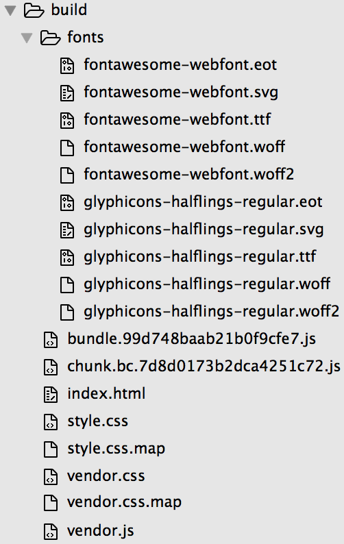

# 在Node.js中调用webpack+反向代理

## 目标
1、不使用命令行，由Node.js调用webpack执行打包操作；   
2、开启webpack-dev-server代理，并实现数据反向代理。    

## 知识点
1、[webpack-dev-server代理proxy](https://webpack.js.org/configuration/dev-server/#devserver-proxy)：webpack-dev-server可以配置代理；  
2、[mockjs](http://mockjs.com/)：生成随机数据；  
3、[Node.js spawn](https://nodejs.org/dist/latest-v7.x/docs/api/child_process.html#child_process_child_process_spawn_command_args_options)：Node.js子进程；  
4、[express](http://expressjs.com/zh-cn/)：Node.js非常好用的应用框架；  
5、[gulp-util](https://github.com/gulpjs/gulp-util)：可以把webpack的打包提示信息美观地展现。  

## 课程内容
webpack提供了一个Node.js API，能够在Node.js运行时被调用。咱们依然在lesson5的基础上进行代码改造，npm安装express、gulp-util、mockjs
```
npm install express gulp-util mockjs --save
```
新建一个app.js
```
touch app.js
```
copy进去以下代码
```js
#! /usr/bin/env node --harmony

const fs = require('fs'),
  path = require('path'),
  gutil = require('gulp-util'),
  webpack = require('webpack'),
  webpackDevServer = require('webpack-dev-server'),
  webpack_config = require('./webpack.config'),
  Mock = require('mockjs'),
  Random = Mock.Random,
  express = require('express'),
  app = express();

// 启动webpack-dev-server
const compiler = webpack(webpack_config('development'));
new webpackDevServer(compiler, {
  //  这里填写的参数将会插入或者替换webpack.config.js中的原配置
  stats: {
    colors: true,
    chunks: false
  },
  noInfo: false,
  proxy: {
    '*': {
      target: 'http://localhost:3000',
      // 代理到本地3000端口，也就是咱们node运行的端口
    }
  }
}).listen(8080,
function() {
  console.log('App (dev) is now running on port 8080!');
});

// 生成随机数据，测试时非常方便
app.get('/mockData',
function(req, res, next) {
  let template = {
    "string|1-10": "★",
    "number|123.10": 1.123,
    'regexp': /[a-z][A-Z][0-9]/,
    'date': Random.date('yyyy-MM-dd'),
    'image': Random.image(),
    'paragraph': Random.cparagraph()
  };
  let generateData = Mock.mock(template);
  res.send(generateData);
  next();
});

// webpack打包
app.get('/build',
function(req, res, next) {
  webpack(webpack_config('production'),
  function(err, stats) {
    gutil.log('[webpack:build]', stats.toString({
      chunks: false,
      colors: true
    }));
    if (err) {
      throw new gutil.PluginError('webpack:build', err);
    }
    res.send({
      success: true
    });
    next();
  });
});
// 监听3000端口
app.listen(3000,
function() {
  console.log('Proxy Server is running on port 3000!');
});
```
copy以下代码到webpack.config.js，自此不需要用npm命令来打包了，也就可以不需要用到process.env.NODE_ENV的值，为了区分开发和生产环境，这里把webpack.config.js exports成一个函数，并通过传递参数NODE_ENV，最终返回一个配置对象
```js
const path = require('path'),
  HtmlWebpackPlugin = require('html-webpack-plugin'),
  webpack = require('webpack'),
  ExtractTextPlugin = require("extract-text-webpack-plugin"),
  OpenBrowserPlugin = require('open-browser-webpack-plugin'),
  extractVendor = new ExtractTextPlugin('vendor.css'),
  extractStyle = new ExtractTextPlugin('style.css');

module.exports = (NODE_ENV) = >{
  let config = {
    entry: NODE_ENV === 'production' ? {
        vendor: ['jquery', 'bootJs'],
        app: './webpack.entry'
      } : [
        'webpack-dev-server/client?http://localhost:8080', 
        'webpack/hot/only-dev-server', 
        './webpack.entry.js'
    ],
    output: {
      filename: 'bundle.[hash].js',
      path: path.resolve(__dirname, './build'),
      publicPath: '',
      chunkFilename: "chunk.[name].[chunkhash].js"
    },
    context: __dirname,
    module: {
      rules: [{
        test: /\.css/,
        use: NODE_ENV === 'production' ? extractVendor.extract({
          fallback: "style-loader",
          use: "css-loader?minimize=true"
        }) : ['style-loader', 'css-loader?sourceMap']
      },
      {
        test: /\.scss$/,
        use: NODE_ENV === 'production' ? extractStyle.extract({
          fallback: "style-loader",
          use: ["css-loader", "sass-loader"]
        }) : ['style-loader', 'css-loader?sourceMap', 'sass-loader?sourceMap']
      },
      {
        test: /\.(jpg|png)$/,
        use: ['url-loader?limit=10000&name=img/[name].[ext]']
      },
      {
        test: /\.html$/,
        use: 'html-loader?interpolate=require'
      },
      {
        test: /\.js$/,
        exclude: /node_modules/,
        use: {
          loader: 'babel-loader',
          options: {
            presets: ['env']
          }
        }
      },
      {
        test: /\.(eot|svg|ttf|woff|woff2)(\?\S*)?$/,
        use: ['file-loader?name=fonts/[name].[ext]']
      }]
    },
    plugins: NODE_ENV === 'production' ? [
      new HtmlWebpackPlugin({
        template: './src/index.html',
        filename: 'index.html'
      }), 
      extractVendor, 
      extractStyle, 
      new webpack.DefinePlugin({
        'NODE_ENV': JSON.stringify(NODE_ENV)
      }), 
      new webpack.optimize.UglifyJsPlugin({
        compress: {
          warnings: true
        }
      }), 
      new webpack.optimize.CommonsChunkPlugin({
        name: "vendor",
        filename: "vendor.js",
        minChunks: Infinity,
      }), 
      new webpack.ProvidePlugin({
        $: 'jquery',
        jQuery: 'jquery'
      })
    ] : [
      new HtmlWebpackPlugin({
        template: './src/index.html',
        filename: 'index.html'
      }), 
      new webpack.HotModuleReplacementPlugin(), 
      new webpack.NamedModulesPlugin(), 
      new webpack.DefinePlugin({
        'NODE_ENV': JSON.stringify(NODE_ENV)
      }), 
      new OpenBrowserPlugin({
        url: 'http://localhost:8080/'
      }), 
      new webpack.ProvidePlugin({
        $: 'jquery',
        jQuery: 'jquery'
      })
    ],
    devServer: {
      contentBase: path.resolve(__dirname, 'src'),
      hot: true,
      noInfo: false
    },
    devtool: 'source-map',
    resolve: {
      extensions: ['.js', '.scss', '.html'],
      alias: {
        'jquery': 'jquery/dist/jquery.min.js',
        'bootCss': 'bootstrap/dist/css/bootstrap.css',
        'bootJs': 'bootstrap/dist/js/bootstrap.js',
        'fontAwesome': 'font-awesome/css/font-awesome.css'
      }
    }
  };

  return config;
};
```
copy以下代码到body.html中
```html
<h1 class="body-title">this is body</h1>
<i class="fa fa-cog fa-spin fa-3x fa-fw"></i>
<ul class="body-list">
  <li class="body-list-item" id="body-input">你可以使用BannerPlugin给你的每个打包文件加上你的签名<br>webpack教程<br>by kingvid</li>
</ul>
<button id="body-btn" class="btn">点我</button>
<button id="pack-btn" class="btn">打包</button>
<button id="getData-btn" class="btn">获取本地测试数据</button>
<div id="mockData-con"></div>
<div class="mask"><span><i class="fa fa-spinner fa-pulse fa-3x fa-fw"></i></span></div>
```
copy以下代码到body.js中
```js
var element = $("#body-input"),
str = element.html(),
progress = 0,
timer = setInterval(() = >{
  let current = str.substr(progress, 1);
  if (current == '<') {
    progress = str.indexOf('>', progress) + 1;
  } else {
    progress++;
  }
  element.html(str.substring(0, progress) + (progress && 1 ? '_': ''));
  if (progress >= str.length) {
    clearInterval(timer);
    element.html(str.substring(0, progress));
  }
},
150);

require('../../public/a.js');
$("#body-btn").click(() = >{
  require.ensure(['../../public/b.js'],
  function(require) {
    require('../../public/c.js');
  },
  'bc');
});

$("#pack-btn").click(() = >{
  $(".mask").addClass('active');
  $.ajax({
    url: '/build',
    success: (data) = >{
      if (data.success) {
        alert('打包成功，请查看build文件夹');
      } else {
        alert('打包失败!');
      }
      $(".mask").removeClass('active');
    }
  });
});

$("#getData-btn").click(() = >{
  $.ajax({
    url: '/mockData',
    success: (data) = >{
      let str = '';
      str = '<h1>' + data.date + '</h1><ul>';
      str += '<li>' + data.string + '</li>' + '<li>' + data.paragraph + '</li>' + '<li>' + data.number + '</li>';
      str += '';
      $("#mockData-con").append(str);
    }
  });
});
```
copy以下代码到body.scss中
```css
.body-title{
  border-radius: 4px;
  border: solid 1px #ccc; 
  color: #fff;
  background-color: rgba(0,0,0,0.9);
}
.body-list{
  margin: auto;
  list-style: none;

  .body-list-item{
    font-size: 20px;
  }
}

.mask{
  background-color: rgba(255,255,255,0.9);
  position: fixed;
  top: 0;
  left: 0;
  width: 100%;
  height: 100%;
  z-index: 999;
  text-align: center;
  display: none;

  &.active{
    display: block;
  }

  span{
    display: inline-block;
    margin: auto;
    position: absolute;
    top: 50%;
    left: 50%;
    transform: translate(-50%, -50%, 0);
  }
}

button.btn{
  display: block;
  margin: 10px auto;
}

#mockData-con{
  text-align: left;
}
```
运行`node app.js`，效果如下：  
  
打包后目录如下：  
  

## 补充
现在开发服务（8080端口）和代理服务（3000端口）是包含在一个进程中了，假设咱们要关闭webpack-dev-server或重启它的话，就会影响到整个进程了，这里咱们可以这样操作，把webpack-dev-server放到Node.js的一个子进程里面去，如果要关闭webpack-dev-server的话，就不会影响到主进程了。  
新建一个webpackDevServer.js文件
```
touch webpackDevServer.js
```
copy进去以下代码
```js
const webpack = require('webpack');
const webpack_config = require('./webpack.config');
const webpackDevServer = require('webpack-dev-server');

//webpack dev server
const compiler = webpack(webpack_config('development'));
new webpackDevServer(compiler, {
  stats: {
    colors: true,
    chunks: false
  },
  noInfo: false,
  proxy: {
    '*': {
      target: 'http://localhost:3000',
    }
  }
}).listen(8080,
function() {
  console.log('App (dev) is now running on port 8080!');
});
```
修改app.js
```js
#! /usr/bin/env node --harmony

const fs = require('fs'),
  path = require('path'),
  gutil = require('gulp-util'),
  webpack = require('webpack'),
  webpack_config = require('./webpack.config'),
  Mock = require('mockjs'),
  Random = Mock.Random,
  express = require('express'),
  app = express();

// 用子进程开启webpack-dev-server，可按需对子进程关闭和重启
/* 可运行以下语句关闭该子进程
 * devServer.stdin.pause();
 * devServer.kill();
 */
// 如果要重启子进程，运行`devServer = startServer();`
var devServer = startServer();
function startServer() {
  let spawn = require('child_process').spawn,
  devServer = spawn('node', ['webpackDevServer.js']);

  devServer.stdin.setEncoding('utf-8');
  devServer.stdout.pipe(process.stdout);
  devServer.stdin.end();
  devServer.on("error",
  function(err) {
    console.log("Server error:", err);
  });
  devServer.on("close",
  function(code) {
    console.log('webpack-dev-server has shutted down!', code);
  });
  return devServer;
}

// 生成随机数据，测试时非常方便
app.get('/mockData',
function(req, res, next) {
  let template = {
    "string|1-10": "★",
    "number|123.10": 1.123,
    'regexp': /[a-z][A-Z][0-9]/,
    'date': Random.date('yyyy-MM-dd'),
    'image': Random.image(),
    'paragraph': Random.cparagraph()
  };
  let generateData = Mock.mock(template);
  res.send(generateData);
  next();
});

// webpack打包
app.get('/build',
function(req, res, next) {
  webpack(webpack_config('production'),
  function(err, stats) {
    gutil.log('[webpack:build]', stats.toString({
      chunks: false,
      colors: true
    }));
    if (err) {
      throw new gutil.PluginError('webpack:build', err);
    }
    res.send({
      success: true
    });
    next();
  });
});
// 监听3000端口
app.listen(3000,
function() {
  console.log('Proxy Server is running on port 3000!');
});
```
运行`node app.js`，效果如上，页面运行顺利。