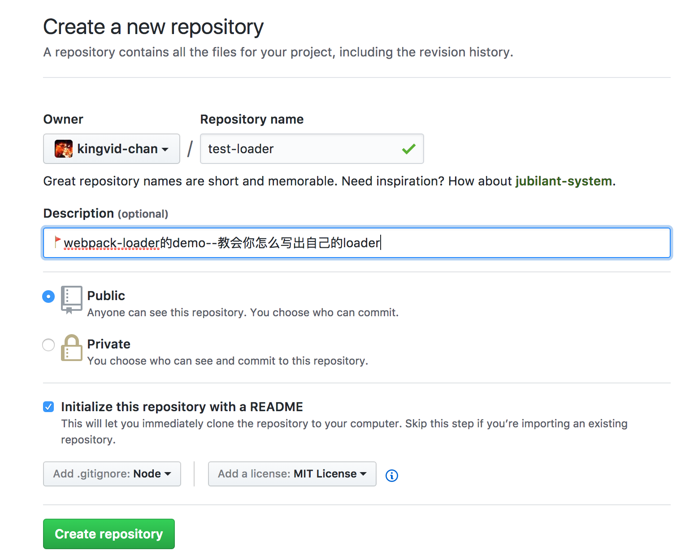
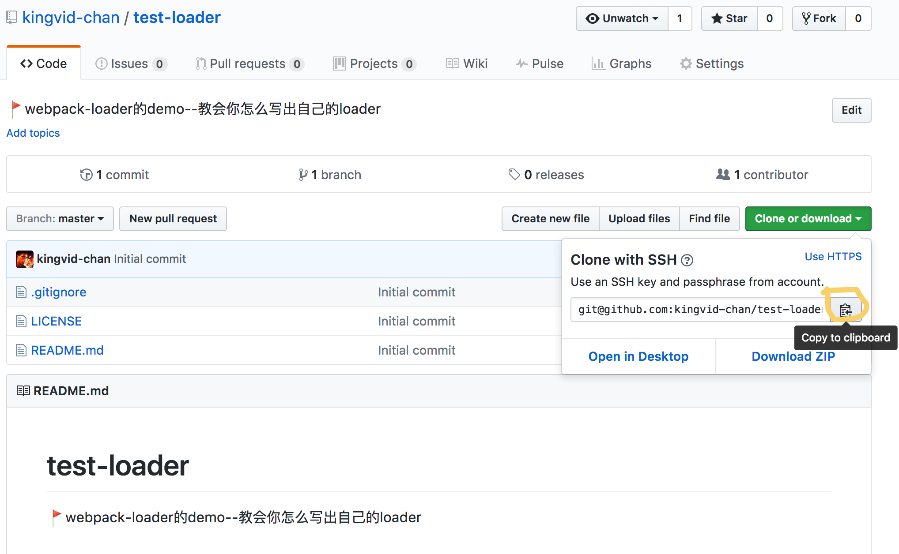
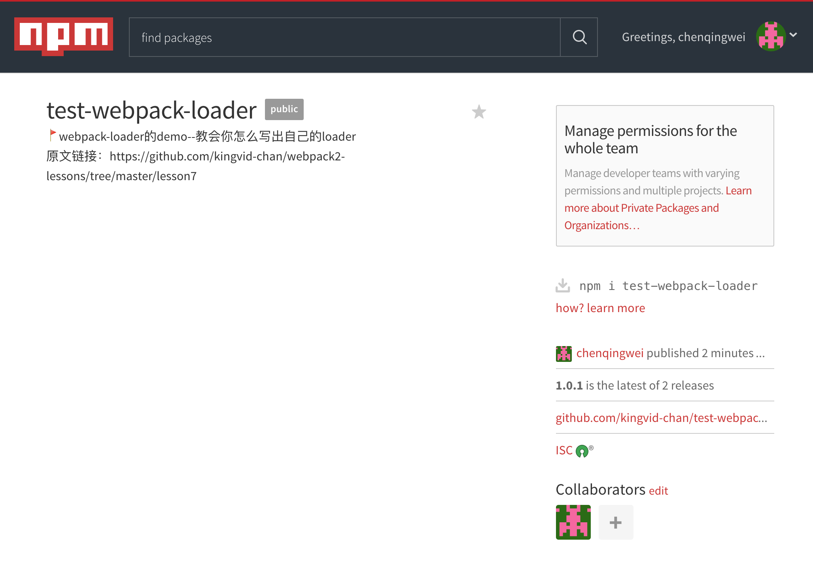
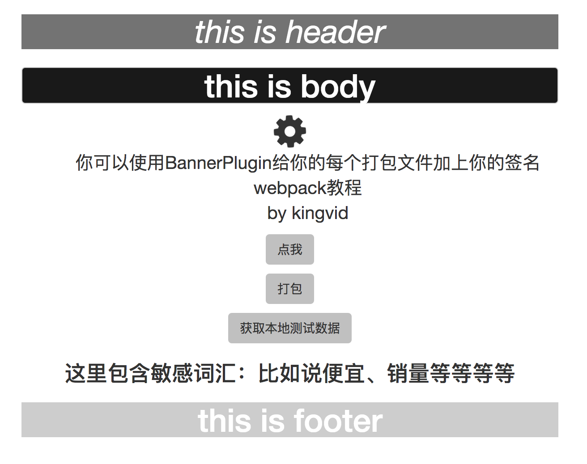
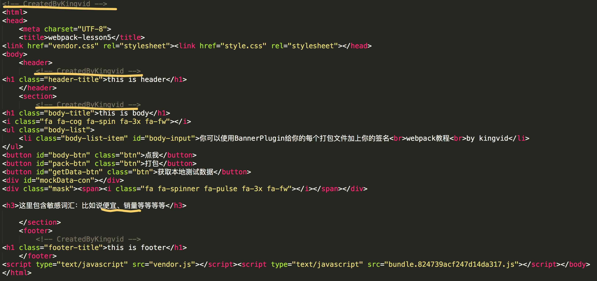

# 《写出自己的loader》

## 目标
写出一个loader，实现在html文件内容前面添加个人签名、以及自动替换掉敏感词汇的功能，当对应的词汇文件修改时，页面会自动刷新。该loader需能够协作其他loader，实现链式调用。

## 挑战
写出一个loader，要求每个模块文件依赖于各不相同的敏感词汇json文件。

## 知识点
1、node module：一个loader就是一个npm包，输出一个function；  
2、npm publish：发布npm包；  
3、loader API：通过在loader函数中使用`this`可以调用loader的API；  
4、[loader-utils](https://github.com/webpack/loader-utils)：推荐使用 loader-utils 来处理loader被调用时传递进来的参数；  
5、从webpack2.0开始，webpack默认支持对json文件的解析，而不需要引入json-loader了；
6、异步解析：根据项目实际需要，解析文件时可能需要依赖于其他文件，直到该文件异步读取完毕之后再对原文件做解析。

## 课程内容

### 前言
自定义一个webpack loader是比较简单的事情，要使用到的API也很少，非常容易上手。  
我们知道，前端开发时数据和代码是要分开管理的，比如说我司前端用的是vm模版引擎，流程是后台java渲染数据之后再返回到前端，为了在本地开发时方便，我们的做法是在本地生成模拟的json数据，通过webpack loader引入渲染之后直接在本地展现出来。  
一般每个模块的数据类型和数据量都是各不相同的，所以把每个模块的数据分别保存到独立的json文件中进行管理是比较合理的做法。在这里我抛砖引玉，本次课程会讲单个数据文件的引入，在课程挑战中由读者独立思考并实现，如果存有疑问的话可以参照[vm-loader](https://github.com/kingvid-chan/vm-loader)。  

### loader API
在loader中，咱们可以通过关键词`this`访问当前执行环境的所有变量  
1、同步回调时，可以执行this.callback()，默认第一个参数是err错误信息（不报错时返回null），第二个参数是解析完模块后的返回结果，第三个参数是sourceMap（可选），在链式调用时可将sourceMap传给下一个loader；  
2、异步回调时，可以执行this.async()，参数同上；  
3、this.addDependency(filePath)可以把对应filePath的文件添加到webpack的依赖树，webpack可以监测它的文件变动并刷新（filePath要是绝对路径）；
4、this.resolve()可以解析处理文件路径；     
5、this.query：获取loader的配置选项。

### loader-utils方法
1、getOptions：检索被调用loader的配置选项；   
2、parseQuery：解析被调用loader的配置选项；  
3、stringifyRequest：将一个请求转化为非绝对路径的可被require或import的字符串；  
4、urlToRequest：将url转换成适合webpack环境的模块请求；  
5、interpolateName：自定义资源名称、hash等；  
6、getHashDigest：通过限制字符长度获取文件部分哈希值。

### 开始
先在github上创建一个`test-loader`仓库，  
  
在跳转的页面复制仓库链接，clone到本地（可能会clone不成功，需要事先配置好ssh key，也可以直接下载压缩包到本地）  
  
```
git clone git@github.com:kingvid-chan/test-loader.git
cd test-loader
npm init -y
npm install loader-utils --save-dev
touch index.js
```
copy以下代码到index.js
```js
'use strict';
// loader-utils可以解析webpack配置文件中loader传入的参数
const loaderUtils = require('loader-utils');

module.exports = function(source) { // source是字符串，包含静态资源的文件内容
    // webpack2 默认使用缓存，启动webpack-dev-server时，只热更新被修改的模块
    // 如果你想要禁止缓存功能，只要传入fasle参数即可
    // this.cacheable(false);  

    const params = loaderUtils.parseQuery(this.query);
    if (typeof params === "object" && params.signStr && typeof params.signStr === "string") {
        source = '<!-- ' + params.signStr + ' -->\n' + source;
    }

    return source;
};
```
做完这一步之后，咱们已经能够实现给html模块添加签名了，接着添加敏感词汇替换的功能。
修改index.js如下：
```js
'use strict';
// loader-utils可以解析webpack配置文件中loader传入的参数
const loaderUtils = require('loader-utils'),
	path = require('path'),
	fs = require('fs');

module.exports = function(source) { // source是字符串，包含静态资源的文件内容
    // webpack2 默认使用缓存，启动webpack-dev-server时，只热更新被修改的模块
    // 如果你想要禁止缓存功能，只要传入fasle参数即可
    // this.cacheable(false);  

    const params = loaderUtils.parseQuery(this.query),
        callback = this.async(); // 异步解析模块
    if (typeof params === "object") {
    	// 添加个人签名
    	if (params.signStr && typeof params.signStr === "string") {
    	    source = '<!-- ' + params.signStr + ' -->\n' + source;
    	}
    	// 自动替换掉敏感词汇
    	if (params.dataPath && typeof params.dataPath === "string") {
    		let dataPath = path.resolve(params.dataPath);  // 转换为绝对路径
    		this.addDependency(dataPath); // 添加依赖关系，当文件修改时会被webpack检测到

            
            // 异步读取敏感词汇的json文件
            fs.readFile(dataPath, 'utf-8', function(err, text){
                if(err) {
                    console.error('数据文件路径出错', params.dataPath, '找不到该文件');
                    return callback(err, source);
                }
                let data = JSON.parse(text),
                    regexRule='(';

                for (let value in data) {
                    regexRule += data[value]+'|';
                }
                regexRule = regexRule.slice(0, -1) + ')';

                let regex = new RegExp(regexRule, 'g'); // 正则替换
                source = source.replace(regex, '');
                callback(null, source); // 异步回调处理结果
            });
    	}else{
            callback({error: 'dataPath is not legal'}, source);
        }
        // console.log(source);
    }
};
```
至此，自动替换敏感词汇的功能也已经实现了，咱们试着将它运行到项目中去，在运行到具体项目之前，咱们需要先把它发布到npm的包管理服务器上，可供所有人在线下载使用。
```
touch .npmignore
```
写入以下代码：
```
node_modules/
```
发布之前需要先登陆你的npm账号，运行`npm adduser`，输入你在npm官网上的账户--username、password、email，如果没有的话就新注册一个，完成之后运行`npm whoami`就可以看到你的名字了。点击发布
```
npm publish
```
提示发布失败，失败原因是没有权限发布名为`test-loader`的包，也就是这个包名字已经被别人占用了，上[npm官网](https://www.npmjs.com/)搜索显示确实已经存在这个包，咱们换个名字，把package.json的name属性修改一下：
```
"name": "test-webpack-loader"
```
再尝试发布一下
```
npm publish
```
发布成功，到npm主页也能被检索到。  
  

### 运行到实际项目中
咱们依然在lesson6的基础上做修改，把lesson6的`src`目录、`app.js`、`webpack.config.js`、`webpack.entry.js`、`webpackDevServer.js`copy进来，初始化再安装依赖包
```
npm init -y
npm install babel-core babel-loader babel-preset-env css-loader extract-text-webpack-plugin file-loader html-loader html-webpack-plugin node-sass open-browser-webpack-plugin sass-loader style-loader url-loader webpack webpack-dev-server --save-dev
npm install bootstrap express font-awesome gulp-util jquery mockjs --save
```
再安装下咱们刚刚发布到npm的`test-webpack-loader`
```
npm install test-webpack-loader --save-dev
```
webpack.config.js需要修改下html文件的loader配置
```js
{
    test: /\.html$/,
    use: [
        'html-loader?interpolate=require',
        'test-webpack-loader?signStr=CreatedByKingvid&dataPath=./src/words.json'
    ]
}
```
另外在body.html中加入一些敏感词汇
```html
<h1 class="body-title">this is body</h1>
<i class="fa fa-cog fa-spin fa-3x fa-fw"></i>
<ul class="body-list">
	<li class="body-list-item" id="body-input">你可以使用BannerPlugin给你的每个打包文件加上你的签名<br>webpack教程<br>by kingvid</li>
</ul>
<button id="body-btn" class="btn">点我</button>
<button id="pack-btn" class="btn">打包</button>
<button id="getData-btn" class="btn">获取本地测试数据</button>
<div id="mockData-con"></div>
<div class="mask"><span><i class="fa fa-spinner fa-pulse fa-3x fa-fw"></i></span></div>
<h3>这里包含敏感词汇：比如说最便宜、销量第一等等等等</h3>
```
运行`node app.js`，可以看到敏感词汇已经自动过滤了  
  
点击`打包`按钮，完成后查看index.html代码，签名以及敏感词汇过滤的功能都已经实现。  
  

## 补充知识
注意不要给被处理模块中添加绝对路径，当项目被移动到别的位置时，会破坏webpack的hash解析，可以使用`loaderUtils`的`stringifyRequest`函数，它能将绝对路径转化为相对路径；  

# 总结
npm发布的时候注意是否已有重名npm包导致发布失败，最好能一开始就查询好能用的命名，不用像我一样，为了规范回头还要去把github仓库重命名一次，关于`test-webpack-loader`的详细源码可以查看 https://github.com/kingvid-chan/test-webpack-loader   
测试时不一定需要把loader发布到npm上，也可以直接把test-webpack-loader文件夹copy到lesson7的node_modules下就能被调用了。